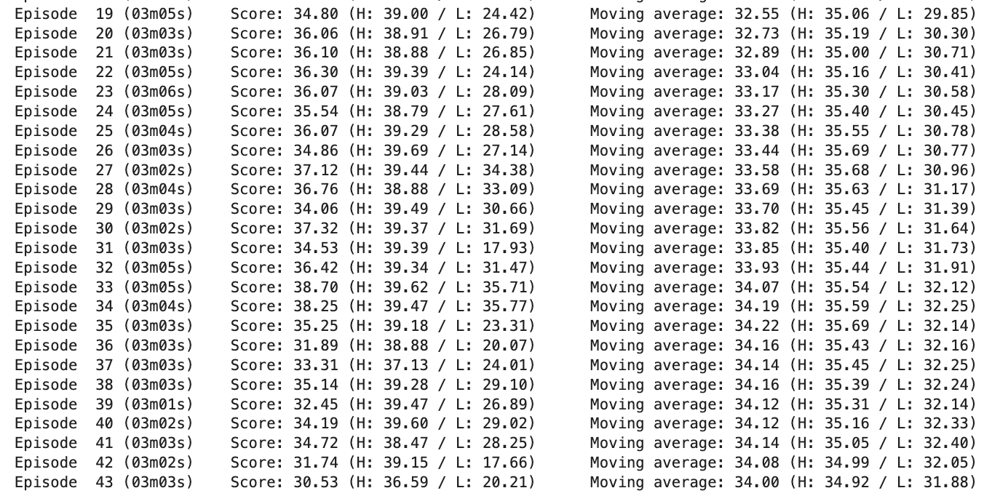

# Project 2: Continuous Control

## Description of the implementation

### Algorithm
To solve this project, I used the Deep Deterministic Policy Gradient. A thorough explanation can be find in the paper 
presenting it [Continuous control with deep reinforcement learning](https://arxiv.org/abs/1509.02971).

### Implementation

To start, I created the Actor and Critic networks flexible each receiving as input apart from state and action size the 
number of neurons in each layers as parameter the number of hidden layers. This gave me more flexibility for fine tuning
 the model.  

Then I implemented the agent with a replay buffer to store experiences along training. 

Then, I proceeded to implement the Agent with the initial purpose of solely instantiate the networks and take actions, 
so that I could test whether the Actor was operating correctly.  

Next, I implemented the replay buffer so as to store experiences and allow the training phase to take place.  

I read on the internet about some interesting process *Ornstein-Uhlenbeck* and decided to add it to this project.

### Fine-tuning of the hyperparameters

I tried values for the neural network at first but kept with the exposed values in the paper.
I used a classic learning rate of $1e-3$ and for the batch size 128. 
For the replay buffer 5 episodes of 1000 steps seemed enough. And $\Gamma$ was set to $0.99$ so quite exploratory. 
I cancelled most of the noise using a 0.999 decay rate.

I draw a table to sum up the values of the hyperparameters.

|Actor Network   | 400,300    | 
|----------------|------------|
| Critic Network | 400,300    |
| t_step         |  1000      |  
| lr             |  $1e-3$    |
| batch_size     |  128       |
| $\gamma$       |  0.99      |
| $\tau$         |  1e-3      |
| noise decay    | 0.999      |
| buffer size    | 1e5        |

### Network architecture  

The Actor Network receives as input 33 variables representing the observation space and generates as output 4 numbers 
representing the predicted best action for this observed state. That means, the Actor is used to approximate the optimal
policy _π_ deterministically.

The Critic Network receives as input 33 variables representing the observation space. The result of the Critic's first 
hidden layer and the action from the Actor Network are stacked to be passed in as input for the Critic's 
second hidden layer.  
The output of this network is the prediction of the target value based on the given state and the estimated best action.  
That means the Critic calculates the optimal action-value function _Q(s, a)_ by using the Actor's best-believed action.

## Result

I reached the threshold needed to consider the environnement solved but I could not say precisely the number of episodes
to reached this solution. The workspace provided by Udacity kept going idle before I finished training. Hopefully I 
stored the weights of the neural networks to pursue training. Summing up the different training, the environnement was 
solved in 10 steps. In the `Continuous_Control.ipynb` notebook is shown the last episodes of the training.

The last reward is shown in the following picture :

## Ideas for Future Work

I wish I could have plot curve for the different agents. I will keep trying to improve this model and add some 
improvements. 

My goal is to change the model to a D4PG model as presented here [D4PG - Distributed Distributional Deterministic Policy Gradients](https://arxiv.org/pdf/1804.08617.pdf)
Then I'd like to look at the performences of [A3C - Asynchronous Advantage Actor-Critic](https://arxiv.org/abs/1602.01783).
 

